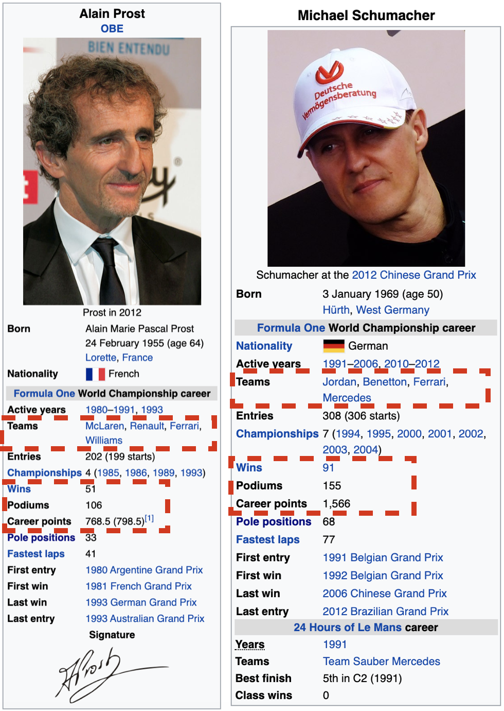

```{r setup, include=FALSE}
knitr::opts_chunk$set(echo = TRUE, warning = FALSE)
```

## Introduction
This project is a sample displaying some of my analytical capabilities in R. It will demonstrate how useful R can be to perform analysis that is easy to reproduce and communicate. This is by no means an exhaustive demonstration of my proficiency with R, but should highlight common data analysis functions that I perform regularly.

## Analysis Goals
I have little to no knowledge of Formula One racing. My only insight prior to conducting this analysis is that Lewis Hamilton is one of the best drivers to ever touch a steering wheel. My goal for this project is to analyze the data to increase my knowledge of the sport and its participants. After conducting my EDA, I plan on creating a model that can be used to predict a driver's probability of finishing 3rd or higher in their next race.

## R Shiny Dashboard
Coming soon...

## Data Sources
The data used for this analysis contains a wide range of information related to Formula One races from 1950 through 2017. The data are currently separated into various tables. Part of this exercise will require me to verify the accuracy of the data and combine the tables into a more easy to interpret format. The data used for this analysis can be found at the following Kaggle link. <br>
[F1 Race Data](https://www.kaggle.com/cjgdev/formula-1-race-data-19502017)

## Data Import
Loading necessary packages for analysis.
```{r, message = FALSE}
library(car)
library(tidyverse)
library(lubridate)
library(scales)
library(caret)
library(caretEnsemble)
library(ggsci)
library(ggmap)
library(Information)
library(PRROC)
library(OptimalCutpoints)
```

Loading csv files containing the data.
```{r, message = FALSE}
circuits <- read_csv("Raw Data/circuits.csv")
constructor_results <- read_csv("Raw Data/constructorResults.csv")
constructors <- read_csv("Raw Data/constructors.csv")
constructor_standings <- read_csv("Raw Data/constructorStandings.csv")
drivers <- read_csv("Raw Data/drivers.csv")
driver_standings <- read_csv("Raw Data/driverStandings.csv")
lap_times <- read_csv("Raw Data/lapTimes.csv")
pit_stops <- read_csv("Raw Data/pitStops.csv")
qualifying <- read_csv("Raw Data/qualifying.csv")
races <- read_csv("Raw Data/races.csv")
results <- read_csv("Raw Data/results.csv")
seasons <- read_csv("Raw Data/seasons.csv")
status <- read_csv("Raw Data/status.csv")
european_countries <- read_csv("Raw Data/european_countries.csv")
```

## Data Wrangling/Cleansing
### Data Inspection

Now that the data is loaded, I can begin to inspect it to determine if any transformations are be needed before I can conduct further analysis.

```{r}
glimpse(drivers)
```

I will repeat this process with the other tables using the following method.
```{r, eval = FALSE}
map(list(circuits, constructor_results, constructors,
         constructor_standings, drivers, driver_standings,
         lap_times, pit_stops, pit_stops,
         qualifying, races, results,
         seasons, status), glimpse)
```
### Data Cleansing

As expected, the data need to be cleaned. There are unneeded fields for links to Wikipedia pages, missing data in fields, redundant variables, and date-time issues that need to be resolved. The next couple of sections will focus on the transformations needed to clean the data.

```{r}
results %>%
  #Removes the redundant positionText variable
  select(-positionText) %>%
  #Converts the fastestLapTime and race time variables to hms
  mutate(fastestLapTime = hms::as_hms(paste0("00:", str_sub(paste0(fastestLapTime), start = 1, end = 5))),
         f_time = hms::as_hms(as_datetime(milliseconds(milliseconds)))) %>%
  #Removes the updated variables
  select(-time, -milliseconds) -> results

drivers %>%
  #Removing the driverRef variable since it usually the same as the surname
  #Removing the number and code variables becuase they aren't available for all drivers
  select(-c(driverRef, number, code, url)) %>%
  #Converts the dob variable to date format
  mutate(dob = dmy(dob)) -> drivers

#Some of the circuit names and locations contain characters that weren't formatted correctly
#These update are used to correct the circuit name issues
circuits[18, 3] <- "Autódromo José Carlos Pace"
circuits[20, 3] <- "Nürburgring"
circuits[20, 4] <- "Nürburg"
circuits[4, 4] <- "Montmeló"
circuits[25, 3] <- "Autódromo Juan y Oscar Gálvez"
circuits[27, 3] <- "Autódromo do Estoril"
circuits[32, 3] <- "Autódromo Hermanos Rodríguez"
circuits[36, 3] <- "Autódromo Internacional Nelson Piquet"
circuits[49, 3] <- "Montjuïc"

#Removes unneeded variables
circuits %>%
  select(-c(circuitRef, alt, url)) -> circuits

#Removes unneeded variables
constructors %>%
  rename(c_name = name, c_nationality = nationality) %>%
  select(-c(constructorRef, url, X6)) -> constructors

#Renames the pit stop duration variable
pit_stops %>%
  mutate(ps_duration = as.numeric(duration)) %>%
  select(-c(duration, milliseconds)) -> pit_stops

#Updates the variable names and removes the url variable
races %>%
  rename(race_year = year, race_round = round, race_name = name, race_date = date,
         race_time = time) %>%
  select(-url) -> races

#Uses the milliseconds column to calculate the lap times in hms format
lap_times %>%
  mutate(l_time = hms::as_hms(as_datetime(milliseconds(milliseconds)))) %>%
  select(-c(time, milliseconds)) -> lap_times
  
```

The rest of the tables contain either unneeded or redundant information that can be imputed by using other available information.

```{r}
rm(constructor_results, constructor_results, constructor_standings, driver_standings, qualifying, seasons)

```

### Data Validation

The last step before combining the various tables is to validate the accuracy of the information that they hold. A quick Wikipedia search returns information that should assist with this process. Validating the data allows me to have greater confidence in the accuracy of my analysis and predictions. I can also use the statistics that I am going to calculate to check my data once it's joined.  <br>

First up are the `results` and `drivers` tables. I'm choosing to examine a driver who was retired before the last date that the data was collected. That way I can confirm if the data capture all necessary win statistics to calculate a variety of driver stats.

```{r}
results %>%
  left_join(drivers, by = "driverId") %>%
  filter(surname %in% c("Prost", "Schumacher"), 
         forename %in% c("Alain", "Michael")) %>%
  group_by(forename, surname) %>%
  mutate(win = if_else(position == 1, 1, 0),
         podium = if_else(position %in% c(1:3), 1, 0),
         #Total career wins
         career_wins = sum(win, na.rm = TRUE), 
         #Total career podiums(placed 3rd of higher)
         career_podium = sum(podium, na.rm = TRUE),
         #Total career points(including non Championship points)
         total_points = sum(points, na.rm = TRUE)) %>%
  select(forename, surname, career_wins, career_podium, total_points) %>%
  distinct()

results %>%
  select(raceId, driverId, constructorId) %>%
  left_join(drivers, by = "driverId") %>%
  left_join(constructors, by = "constructorId") %>%
  filter(driverId %in% c(30, 117)) %>%
  group_by(forename, surname) %>%
  distinct(c_name) %>%
  ungroup() %>%
  arrange(surname)

```

So far, so good. The values for the `career_wins`, `career_podium`, and `total_points` variables all match the values found on wikipedia for the drivers shown below. I have also confirmed the various constructors that each driver raced for during their career. I'll repeat this process for other variables in the remaining tables. 

```{r, out.width = "550px", echo = FALSE}


```
<br>

Digging a little deeper into the `lap_times` and `races` tables reveal that the laptime data is only available for races after March, 3rd 1996. Using the same methodology to inspect the `pit_stops` table shows that it only has data back to 2011. There is still enough complete data from the other tables to conduct some insightful exploratory analysis, but the lack of complete lap specific data could prove limiting when trying to build a model. I will have to keep the limitations of these two tables in mind.
```{r}
lap_times %>%
  left_join(races, by = "raceId") %>%
  summarize(oldest_race = min(race_date)) 

pit_stops %>%
  left_join(races, by = "raceId") %>%
  summarize(oldest_race = min(race_date))

races %>%
  summarize(oldest_race = min(race_date))

```

### Joining the Tables

The final step before I can begin analyzing and visualizing the data is to join all of these tables into a master table. This will also make the model creation and testing easier. 

```{r}
results %>%
  select(-c(resultId, number)) %>%
  left_join(drivers, by = "driverId") %>%
  left_join(races, by = "raceId") %>%
  left_join(constructors, by = "constructorId") %>%
  left_join(circuits, by = "circuitId") %>%
  left_join(status, by = "statusId") %>%
  mutate(race_d_rank = dense_rank(race_date)) -> master_table

```

The data within the `lap_times` and `pit_stops` tables will need to be summarized from the lap level to the race level before they can be joined to the `master_table`. I've chosen create a more precise `fastestLap` variable, and add a variable to record the driver with fastest time. I also created summary stats for total pits stops in a race, total pit stop duration, and average pit stop duration.

```{r}
lap_times %>%
  mutate(l_num = as.numeric(l_time)) %>%
  group_by(raceId, driverId) %>%
  top_n(-1, l_num) %>%
  ungroup() %>%
  select(raceId, driverId, position, l_time) %>%
  rename(fl_position = position, fastestLapTime = l_time) %>%
  group_by(raceId) %>%
  mutate(fastestDriverTime = hms::as_hms(min(fastestLapTime))) %>%
  ungroup() -> f_lap_times

pit_stops %>%
  group_by(raceId, driverId) %>%
  summarize(total_stops = sum(stop),
            total_p_duration = sum(ps_duration),
            avg_p_duration = mean(ps_duration, na.rm = TRUE)) -> total_stops

master_table %>%
  select(-fastestLapTime) %>%
  left_join(f_lap_times, by = c("raceId", "driverId")) %>%
  left_join(total_stops, by = c("raceId", "driverId")) -> master_table

```

## Data Analysis

Now comes the fun part! With all of my data combined to a single table, I can begin my exploratory analysis. 

### Most Wins

Given the tidy format of the data it is easy to identify and produce some quick stats on the top 5 drivers by win count. It's pretty clear that finishing in first place isn't easy considering that the top two drivers are barely at a 30% win percentage. It's also very impressive that Alain Prost still sits within the top 3 even though his last race was over 2 decades ago! It's crazy to think that anyone who has watched Lewis Hamilton race was more likely to see him place in the top 3 than not.

```{r}
master_table %>%
  mutate(race_win = if_else(position == 1, TRUE, FALSE),
         podium = if_else(position %in% c(1:3), TRUE, FALSE)) %>%
  group_by(forename, surname) %>%
  summarize(total_wins = sum(race_win, na.rm = TRUE),
            total_podium = sum(podium, na.rm = TRUE),
            last_race = max(race_date),
            total_races = n(),
            win_perc = percent(total_wins / total_races),
            podium_perc = percent(total_podium / total_races)) %>%
  ungroup() %>%
  select(-forename) %>%
  top_n(5, total_wins) %>%
  arrange(desc(total_wins)) %>%
  print.data.frame()
  
```

### Constructor Performance Over Time

Next up is a bar plot that summarizes the top 3 constructors by podiums for each decade. It is clear from this graph that Ferrari was dominating the sport in the 50's and 2000's. Now it seems that Mercedes is the constructor to beat for the majority of the 2010's.

```{r, fig.width=10}
master_table %>%
  mutate(podium = if_else(position %in% c(1:3), 1, 0),
         decade = cut(race_year, breaks = seq(1949, 2019, 10),
                      labels = seq(1950, 2010, 10))) %>%
  group_by(c_name, decade) %>%
  summarize(decade_podium = sum(podium, na.rm = TRUE)) %>%
  ungroup() %>%
  group_by(c_name) %>%
  mutate(total_podium = sum(decade_podium, na.rm = TRUE)) %>%
  ungroup() %>%
  group_by(decade) %>%
  #Couldn't use top_n becasue I needed to utilize the dense_rank window rank function
  mutate(p_rank = dense_rank(decade_podium),
         max_rank = max(p_rank)) %>%
  filter(p_rank > max_rank - 3, c_name != "Cooper-Climax") %>%
  ggplot(aes(as.integer(as.character(decade)), decade_podium, fill = factor(decade))) +
  geom_col(position = position_dodge2(width = 0.8, preserve = "single")) + 
  scale_x_continuous(breaks = seq(1950, 2020, 10)) + scale_fill_npg() +
  scale_y_continuous(limits = c(0, 210)) +
  geom_text(aes(label = c_name, group = c_name), position = position_dodge(width = 9), hjust = -0.01, size = 3, angle = 45) +
  labs(x = "Decade", y = "Podium Count", fill = "Decade")

```


### Median Race Time

This chart illustrates the change in median finish time over the years for the top three circuits with the most races. There is a clear trend as cars and drivers have gotten faster over time. There are some sudden increases in the graph that seem a little counter intuitive. This graph also assumes that a given circuit has stayed the same in terms of distance and difficulty. I would need more data to control for these variables.


```{r, fig.width=10}
master_table %>%
  group_by(name) %>%
  mutate(total_races = n_distinct(raceId)) %>%
  ungroup() %>%
  group_by(name, race_year, total_races) %>%
  summarize(med_time = median(f_time, na.rm = TRUE)) %>%
  ungroup() %>%
  mutate(r_rank = dense_rank(total_races),
         max_rank = max(r_rank)) %>%
  filter(r_rank > max_rank - 3) %>%
  ggplot(aes(race_year, med_time, col = factor(name))) + geom_line(size = 1.5) +
  scale_x_continuous(breaks = seq(1950, 2020, 10)) +
  labs(x = "Year", y = "Finish Time", col = "Circuit") +
  scale_color_npg()

```

### Race Locations

From the graphs I can see that Formula One really is a global sport, even though certain regions do hold more races than others. It is clear that a large amount of races take place in Europe. The second graph zooms into Western Europe to show the dispersion of races across that region.

```{r, fig.width=15, fig.height=7}
#Remove Antartica from the map
map_data("world") %>%
  filter(region != "Antarctica") -> world_data

#Creates a table containg the total number of races per country
master_table %>%
  group_by(name, lat, lng, country) %>%
  summarize(race_count = n_distinct(raceId)) -> rc_count_ll

ggplot() +
  geom_map(data = world_data, map = world_data,
           aes(x = long, y = lat, map_id = region),
           fill = "#a8a8a8", color = "#ffffff", size = 0.5) +
  geom_point(data = rc_count_ll, aes(x = lng, y = lat, size = race_count), 
             col = "red") +
  scale_radius(range = c(2, 7)) +
  labs(size = "Race Count", title = "Total Races by Country (Global)") +
  theme(axis.title=element_blank(),
        axis.text=element_blank(),
        axis.ticks=element_blank(),
        plot.title = element_text(hjust = 0.5))

```

```{r, echo = FALSE, fig.width=10, fig.height=9}
european_countries %>%
  filter(Country != "Russia") %>%
  mutate(Country = recode(Country, "United Kingdom" = "UK")) %>%
  pull() -> european_countries_formatted
  
world_data %>%
  filter(region %in% european_countries_formatted) -> europe_data

rc_count_ll %>%
  semi_join(europe_data %>%
              select(region),
            by = c("country" = "region")) -> rc_count_ll_eu

ggplot() +
  geom_map(data = europe_data, map = europe_data,
           aes(x = long, y = lat, map_id = region),
           fill = "#949494", color = "#ffffff", size = 0.5) +
  geom_point(data = rc_count_ll_eu, aes(x = lng, y = lat, size = race_count), 
             col = "red") +
  labs(size = "Race Count", title = "Total Races by Country (Europe)") +
  scale_radius(range = c(1.5, 10)) +
  theme(axis.title=element_blank(),
        axis.text=element_blank(),
        axis.ticks=element_blank(),
        plot.title = element_text(hjust = 0.5))

```

### Driver Age and Count Over the Decades

This box plot illustrates the change in driver ages over the decades. The median age for drivers has decreased over time from around 34 during the 1950's to about 27 in the 2010's. The cars that the drivers are using today are faster and more sophisticated than those used by their predecessors. This may require drivers to possess faster reflexes and higher stamina for these intense events. The number of championship drivers per decade has also decreased. 

```{r}
master_table %>%
  mutate(decade = as.integer(as.character(cut(race_year, breaks = seq(1949, 2019, 10),
                      labels = seq(1950, 2010, 10))))) %>%
  mutate(age = time_length(interval(dob, race_date), "year")) %>%
  ggplot(aes(decade, age, group = decade)) + geom_boxplot(fill = pal_npg()(10)[5]) +
  scale_x_continuous(breaks = seq(1950, 2020, 10)) +
  scale_y_continuous(breaks = seq(20, 60, 5)) +
  labs(x = "Decade", y = "Age")

master_table %>%
  mutate(decade = as.integer(as.character(cut(race_year, breaks = seq(1949, 2019, 10),
                      labels = seq(1950, 2010, 10))))) %>%
  group_by(decade) %>%
  summarize(driver_count = n_distinct(driverId)) %>%
  ggplot(aes(decade, driver_count), fill = "#E64B35FF") + geom_col(fill = pal_npg()(10)[4]) +
  scale_x_continuous(breaks = seq(1950, 2020, 10))

```

## Podium Predictions


### Feature Engineering

First up in the modeling process is deciding what transformations may be useful for our input variables. Utilizing the lap performance data such as lap times and pit stops would be useful, but unfortunately that data aren't available for all drivers. My goal is to create a model that uses available data for all of the drivers. The new variables that I have decided to create are median race position, total career points, total career podiums, podiums as a percent of total races, career length, and grid position for the next race. All of these metrics will be summarized as career totals just before the drivers next race. The goal is to capture all available career data for each driver and use that to train the model.

```{r}
master_table %>%
  filter(!is.na(dob), race_d_rank < 700) %>%
  group_by(driverId) %>%
  mutate(r_rank = dense_rank(race_date),
         r_max = max(r_rank)) %>%
  ungroup() %>%
  mutate(next_race_grid = if_else(r_rank == r_max, grid, 0),
         race_age = time_length(interval(dob, race_date), "years"),
         podium = if_else(positionOrder %in% c(1:3), 1, 0),
         next_race_podium = if_else(r_rank == r_max - 1, podium, 0),
         next_race_id = if_else(r_rank == r_max -1, raceId, 0)) %>%
  group_by(driverId, forename, surname) %>%
  mutate(nr_grid = max(next_race_grid, na.rm = TRUE),
         nr_podium = max(next_race_podium, na.rm = TRUE),
         nr_id = max(next_race_id, na.rm = TRUE),
         nr_career = time_length(interval(min(race_date), max(race_date)), "years")) %>%
  filter(r_rank < r_max - 1) %>%
  summarize(med_position = median(positionOrder, na.rm = TRUE),
            total_points = sum(points, na.rm = TRUE),
            total_podium = sum(podium, na.rm = TRUE),
            podium_perc = sum(podium, na.rm = TRUE) / n_distinct(raceId),
            nr_career_y = max(nr_career, na.rm = TRUE),
            nr_grid = max(nr_grid, na.rm = TRUE),
            nr_id = max(nr_id, na.rm = TRUE),
            nr_podium = max(nr_podium, na.rm = TRUE)) %>%
  ungroup() -> train_set

```


### Model Examination

Creating box plots for the new variables illustrates how they are related to podium performance. For example, the relationship between a driver's podium percentage and their next race podium performance appears to be what you expect: driver's who place on the podium in their next race tend to have higher podium percentages. Another useful tool is the `vif` function. This function is used to detect multicollinearity amongst the input variables. By utilizig this function, I was able to determine that the total career podiums variable should be removed as it is closlely related to the podium percentage variable. With the variables selected I can examine the model by using the `summary` function. Here we can see that the variables used in the model perform better than the null model. This is a good indication that the variables are helping to increase the fit of the model but I still need to test the model on new data. I can also see that the grid position is the most significant of all the variables in the model.

```{r}
train_set %>%
  ggplot(aes(nr_podium, nr_grid, group = nr_podium)) + geom_boxplot()

# train_set %>%
#   ggplot(aes(nr_podium, podium_perc, group = nr_podium)) + geom_boxplot()
# 
# train_set %>%
#   ggplot(aes(nr_podium, nr_career_y, group = nr_podium)) + geom_boxplot()
# 
# train_set %>%
#   ggplot(aes(nr_podium, total_points, group = nr_podium)) + geom_boxplot()
# 
# train_set %>%
#   ggplot(aes(nr_podium, med_position, group = nr_podium)) + geom_boxplot()

train_set %>%
  select(-c(driverId, nr_id, forename, surname, total_podium)) -> train_set_multi

podium_log <- glm(nr_podium ~ ., family = "binomial",
             data = train_set_multi)

vif(podium_log)

summary(podium_log)

```

### Model Testing

First, I want to test the model on one race. I've chosen a race that wasn;t included in my training set. The test set is created in a similar fashion as the training set. The variables are  comprised of all data before the test race. I then use my model to make predictions on the outcome of this test data. Normally I would have to spend time to determine an appropriate cutoff threshold for the model predictions, as it’s typically uncertain how many outcomes will be either negative or positive. In this case I decided to select the top three response levels from the prediction output as the drivers who are most likely to podium in this race. By creating a confusion matrix, I can examine my model's predictions to the actual race results. The model managed to predict 1 out of the 3 drivers correctly. By combining the model results to the original dataset, I can see more information on the actual and predicted podium drivers.

```{r}
test_race <- 940

master_table %>%
  filter(race_d_rank %in% c(test_race), grid != 0) %>%
  pull(driverId) -> test_drivers

master_table %>%
  filter(!is.na(dob), driverId %in% test_drivers) %>%
  mutate(next_race_grid = if_else(race_d_rank == test_race, grid, 0),
         race_age = time_length(interval(dob, race_date), "years"),
         podium = if_else(positionOrder %in% c(1:3), 1, 0),
         next_race_podium = if_else(race_d_rank == test_race, podium, 0)) %>%
  group_by(driverId, forename, surname) %>%
  mutate(nr_grid = max(next_race_grid, na.rm = TRUE),
         nr_podium = max(next_race_podium, na.rm = TRUE),
         nr_career = time_length(interval(min(race_date), race_date), "years")) %>%
  filter(race_d_rank < test_race) %>%
  summarize(med_position = median(positionOrder, na.rm = TRUE),
            total_points = sum(points, na.rm = TRUE),
            total_podium = sum(podium, na.rm = TRUE),
            podium_perc = total_podium / n_distinct(raceId),
            nr_career_y = max(nr_career, na.rm = TRUE),
            nr_grid = max(nr_grid, na.rm = TRUE),
            nr_id_rank = test_race,
            nr_podium = max(nr_podium, na.rm = TRUE)) %>%
  ungroup() -> test_set

prediction_race <- predict(podium_log, newdata = test_set,
                           type = "response")

test_set %>%
  bind_cols(data.frame("pred" = prediction_race)) %>%
  mutate(p_rank = dense_rank(pred),
         p_max = max(p_rank),
         pred_podium = if_else(p_rank > p_max - 3, 1, 0)) -> test_output

conf_matrix <- table(test_output$pred_podium, test_output$nr_podium)

confusionMatrix(conf_matrix, positive = "1")

test_output %>%
  filter(nr_podium == 1) %>%
  bind_rows(test_output %>%
              filter(pred_podium == 1)) %>%
  left_join(master_table %>%
              select(c_name, driverId, raceId, race_d_rank),
            by = c("nr_id_rank" = "race_d_rank", "driverId"))

```

After examining one race, it looks like my model isn't performing too well. A better way to assess it's performance would be to look at the predictions from all of the races remaining in the test set. Since I only care about the predictions on a race-by-race basis, I need to create a loop to automate the process of testing the model. This loop will repeat the process I just went through for all test races and save the accuracy, the no-information rate, and the sensitivity of each test. I primarily care about the sensitivity, as this measures how well the model can classify drivers who actually podium.

```{r}

i <- c()
pred_acc <- data.frame("test_race" = NA, "accuracy" = NA, "no_info" = NA, "sensi" = NA)
test_race <- c()
test_cutoff <- 700
  
for (i in test_cutoff:976) {
  
test_race <- i

master_table %>%
  filter(race_d_rank %in% c(test_race), grid != 0) %>%
  pull(driverId) -> test_drivers

master_table %>%
  filter(!is.na(dob), driverId %in% test_drivers) %>%
  select(-c(rank, position, fastestLap, fastestLapSpeed, statusId, race_year, circuitId,
            race_name, race_time, c_name, c_nationality, f_time, race_round, name,
            location, country, lat, lng, fl_position, fastestLap, fastestLapSpeed,
            fastestDriverTime, fastestLapTime, total_stops, total_p_duration,
            avg_p_duration)) %>%
  mutate(next_race_grid = if_else(race_d_rank == test_race, grid, 0),
         race_age = time_length(interval(dob, race_date), "years"),
         podium = if_else(positionOrder %in% c(1:3), 1, 0),
         next_race_podium = if_else(race_d_rank == test_race, podium, 0)) %>%
  group_by(driverId, forename, surname) %>%
  mutate(nr_grid = max(next_race_grid, na.rm = TRUE),
         nr_podium = max(next_race_podium, na.rm = TRUE),
         nr_career = time_length(interval(min(race_date), race_date), "years")) %>%
  filter(race_d_rank < test_race) %>%
  summarize(med_position = median(positionOrder, na.rm = TRUE),
            total_points = sum(points, na.rm = TRUE),
            total_podium = sum(podium, na.rm = TRUE),
            podium_perc = total_podium / n_distinct(raceId),
            nr_career_y = max(nr_career, na.rm = TRUE),
            nr_grid = max(nr_grid, na.rm = TRUE),
            nr_id_rank = test_race,
            nr_podium = max(nr_podium, na.rm = TRUE)) %>%
  ungroup() -> master_table_test

prediction_race <- predict(podium_log, newdata = master_table_test,
                           type = "response")

master_table_test %>%
  bind_cols(data.frame("pred" = prediction_race)) %>%
  mutate(p_rank = dense_rank(pred),
         p_max = max(p_rank),
         pred_podium = if_else(p_rank > p_max - 3, 1, 0)) -> test_output

conf_matrix <- table(test_output$pred_podium, test_output$nr_podium)

confusionMatrix(conf_matrix, positive = "1")$overall[1] -> conf_acc
confusionMatrix(conf_matrix, positive = "1")$overall[5] -> null_acc
confusionMatrix(conf_matrix, positive = "1")$byClass[1] -> sensi_level

i -> pred_acc[i - (test_cutoff - 1), 1]
conf_acc -> pred_acc[i - (test_cutoff - 1), 2]
null_acc -> pred_acc[i - (test_cutoff - 1), 3]
sensi_level -> pred_acc[i - (test_cutoff - 1), 4]
  
}

```

### Simple Model Comparison 

Now that I have all of the results collected, I can begin to assess how the model performs. The first table details the various prediction outcomes: 0 drivers correct, 1 driver correct, 2 drivers correct, and 3 drivers correct. Out of the 277 races tested there were only 14 where the model predicted all 3 podium drivers correctly. For 37% of the races, the model was able to predict 2 of the podium drivers correctly. This performance seems okay, but how accurate would my predictions have been if I had just chosen the top 3 drivers by grid position?

```{r}
pred_acc %>%
  group_by(sensi) %>%
  count() %>%
  ungroup() %>%
  mutate(perc = n / sum(n))

```

Simply picking the top 3 drivers by grid position results in a better prediction performance than my model. Obviously, these drivers do not always podium, as seen the in the individual race that I examined earlier. My model could be improved by identifying variables that can better compliment the predictive power of the grid positions.

```{r}
master_table %>%
  filter(race_d_rank >= test_cutoff, position <= 3) %>%
  mutate(grid_corr = if_else(grid <= 3, 1, 0)) %>%
  group_by(raceId) %>%
  summarize(grid_acc = sum(grid_corr) / 3) %>%
  ungroup() %>%
  group_by(grid_acc) %>%
  count() %>%
  ungroup() %>%
  mutate(perc = n / sum(n))


```

## Conclusion
My goal at the beginning of this project was to learn more about Formula One racing and use the data that I have to create a model. Through my analysis, I believe that I have a better understanding of the skill, dedication, and excellence that is required to succeed in a sport that is so competitive. Even though my model was outperformed by a more simplistic prediction approach, it still gave me the opportunity to examine what it takes for a driver to perform well in the sport. More data, different variables, and different models could be used to create a model that outperforms the grid approach.