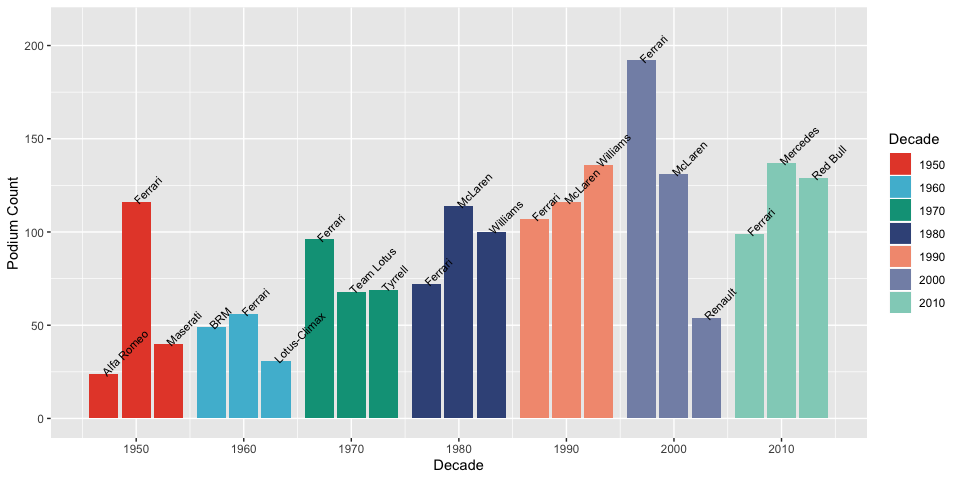
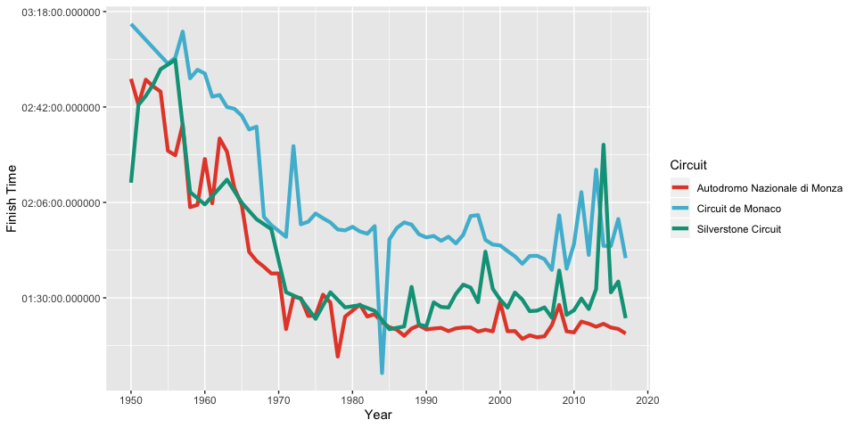
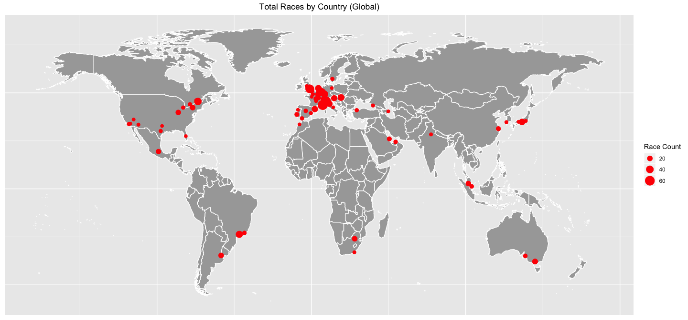
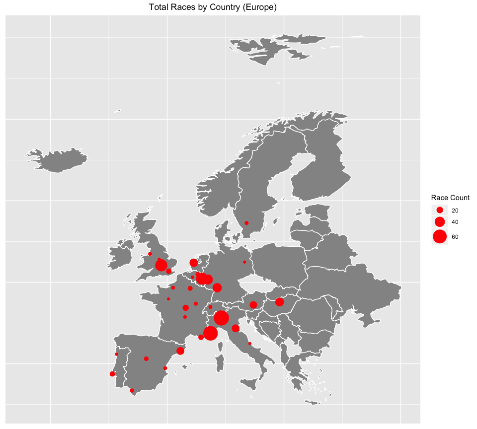

F1 Racing EDA and Podium Predictions (In Progress)
================
Matthew Harris
11/11/2019

  - [Introduction](#introduction)
  - [Analysis Goals](#analysis-goals)
  - [R Shiny Dashboard](#r-shiny-dashboard)
  - [Data Sources](#data-sources)
  - [Data Import](#data-import)
  - [Data Wrangling/Cleansing](#data-wranglingcleansing)
      - [Data Inspection](#data-inspection)
      - [Data Cleansing](#data-cleansing)
      - [Data Validation](#data-validation)
      - [Joining the Tables](#joining-the-tables)
  - [Data Analysis](#data-analysis)
      - [Most Wins](#most-wins)
      - [Constructor Performance Over
        Time](#constructor-performance-over-time)
      - [Median Race Time](#median-race-time)
      - [Race Locations](#race-locations)

## Introduction

This will be used as a sample to display some of my analytical
capabilities in R. This project will demonstrate how useful R can be to
perform analysis that is easy to reproduce and communicate. This is by
no means an exhaustive demonstration of my proficiency with R, but
should highlight common data analysis functions that I perform
regularly.

## Analysis Goals

I have little to no knowledge about Formula One racing. My only insight
prior to conducting this analysis is that Lewis Hamilton is one of the
best drivers to ever touch a steering wheel. My goal for this project is
to analyze the data to increase my knowledge of the sport and its
participants. After conducting my EDA I plan on creating a model that
can be used to predict a driver’s probability of finishing 3rd or higher
in their next race.

## R Shiny Dashboard

Coming soon…

## Data Sources

The data used for this analysis contains a wide range of information of
information pertaining to Formula One races from 1950 through 2017. The
data is currently separated into various tables. Part of this exercise
will require me to verify the accuracy of the data and combine the
tables into a more easy to interpret format. The data used for this
analysis can be found at the following Kaggle link. <br> [F1 Race
Data](https://www.kaggle.com/cjgdev/formula-1-race-data-19502017)

## Data Import

Loading necessary packages for analysis.

``` r
library(car)
library(tidyverse)
library(lubridate)
library(scales)
library(caret)
library(caretEnsemble)
library(ggsci)
library(ggmap)
```

Loading csv files containing the data.

``` r
circuits <- read_csv("Raw Data/circuits.csv")
constructor_results <- read_csv("Raw Data/constructorResults.csv")
constructors <- read_csv("Raw Data/constructors.csv")
constructor_standings <- read_csv("Raw Data/constructorStandings.csv")
drivers <- read_csv("Raw Data/drivers.csv")
driver_standings <- read_csv("Raw Data/driverStandings.csv")
lap_times <- read_csv("Raw Data/lapTimes.csv")
pit_stops <- read_csv("Raw Data/pitStops.csv")
qualifying <- read_csv("Raw Data/qualifying.csv")
races <- read_csv("Raw Data/races.csv")
results <- read_csv("Raw Data/results.csv")
seasons <- read_csv("Raw Data/seasons.csv")
status <- read_csv("Raw Data/status.csv")
european_countries <- read_csv("Raw Data/european_countries.csv")
```

## Data Wrangling/Cleansing

### Data Inspection

Now that the data is loaded I can begin to inspect it to determine if
any transformations will be needed before I can conduct further
analysis.

``` r
glimpse(drivers)
```

    ## Observations: 842
    ## Variables: 9
    ## $ driverId    <dbl> 1, 2, 3, 4, 5, 6, 7, 8, 9, 10, 11, 12, 13, 14, 15, 1…
    ## $ driverRef   <chr> "hamilton", "heidfeld", "rosberg", "alonso", "kovala…
    ## $ number      <dbl> 44, NA, 6, 14, NA, NA, NA, 7, NA, NA, NA, NA, 19, NA…
    ## $ code        <chr> "HAM", "HEI", "ROS", "ALO", "KOV", "NAK", "BOU", "RA…
    ## $ forename    <chr> "Lewis", "Nick", "Nico", "Fernando", "Heikki", "Kazu…
    ## $ surname     <chr> "Hamilton", "Heidfeld", "Rosberg", "Alonso", "Kovala…
    ## $ dob         <chr> "07/01/1985", "10/05/1977", "27/06/1985", "29/07/198…
    ## $ nationality <chr> "British", "German", "German", "Spanish", "Finnish",…
    ## $ url         <chr> "http://en.wikipedia.org/wiki/Lewis_Hamilton", "http…

I will repeat this process with the other tables using the following
method.

``` r
map(list(circuits, constructor_results, constructors,
         constructor_standings, drivers, driver_standings,
         lap_times, pit_stops, pit_stops,
         qualifying, races, results,
         seasons, status), glimpse)
```

### Data Cleansing

As expected the data need to be cleaned. There are unneeded fields for
links to wikipedia pages, missing data in fields, redundant variables,
and datetime issues that need to be resolved. The next couple of
sections will focus on the transformations needed to clean the data.

``` r
results %>%
  #Removes the redundant positionText variable
  select(-positionText) %>%
  #Converts the fastestLapTime and race time variables to hms
  mutate(fastestLapTime = hms::as_hms(paste0("00:", str_sub(paste0(fastestLapTime), start = 1, end = 5))),
         f_time = hms::as_hms(as_datetime(milliseconds(milliseconds)))) %>%
  #Removes the updated variables
  select(-time, -milliseconds) -> results

drivers %>%
  #Removing the driverRef variable since it usually the same as the surname
  #Removing the number and code variables becuase they aren't available for all drivers
  select(-c(driverRef, number, code, url)) %>%
  #Converts the dob variable to date format
  mutate(dob = dmy(dob)) -> drivers

#Some of the circuit names and locations contain characters that weren't formatted correctly
#These update are used to correct the circuit name issues
circuits[18, 3] <- "Autódromo José Carlos Pace"
circuits[20, 3] <- "Nürburgring"
circuits[20, 4] <- "Nürburg"
circuits[4, 4] <- "Montmeló"
circuits[25, 3] <- "Autódromo Juan y Oscar Gálvez"
circuits[27, 3] <- "Autódromo do Estoril"
circuits[32, 3] <- "Autódromo Hermanos Rodríguez"
circuits[36, 3] <- "Autódromo Internacional Nelson Piquet"
circuits[49, 3] <- "Montjuïc"

#Removes unneeded variables
circuits %>%
  select(-c(circuitRef, alt, url)) -> circuits

#Removes unneeded variables
constructors %>%
  rename(c_name = name, c_nationality = nationality) %>%
  select(-c(constructorRef, url, X6)) -> constructors

#Renames the pit stop duration variable
pit_stops %>%
  mutate(ps_duration = as.numeric(duration)) %>%
  select(-c(duration, milliseconds)) -> pit_stops

#Updates the variable names and removes the url variable
races %>%
  rename(race_year = year, race_round = round, race_name = name, race_date = date,
         race_time = time) %>%
  select(-url) -> races

#Uses the milliseconds column to calculate the lap times in hms format
lap_times %>%
  mutate(l_time = hms::as_hms(as_datetime(milliseconds(milliseconds)))) %>%
  select(-c(time, milliseconds)) -> lap_times
```

The rest of the tables contain either unneeded or redudant information
that can be imputed by using other available information.

``` r
rm(constructor_results, constructor_results, constructor_standings, driver_standings, qualifying, seasons)
```

### Data Validation

The last step before combining the various tables is to validate the
accuracy of the information that they hold. A quick Wikipedia search
returns information that should assist with this process. Validating the
data allows me to have greated confidence in the accuracy of my analysis
and predictions. I can also use the statistics that I am going to
calculate to check my data once it’s joined. <br>

First up are the `results` and `drivers` tables. I’m choosing to exmaine
a driver who was retired before the last date that the data was
collected. That way I can confirm if the data capture all necessary win
statistics to calculate a variety of driver stats.

``` r
results %>%
  left_join(drivers, by = "driverId") %>%
  filter(surname %in% c("Prost", "Schumacher"), 
         forename %in% c("Alain", "Michael")) %>%
  group_by(forename, surname) %>%
  mutate(win = if_else(position == 1, 1, 0),
         podium = if_else(position %in% c(1:3), 1, 0),
         #Total career wins
         career_wins = sum(win, na.rm = TRUE), 
         #Total career podiums(placed 3rd of higher)
         career_podium = sum(podium, na.rm = TRUE),
         #Total career points(including non Championship points)
         total_points = sum(points, na.rm = TRUE)) %>%
  select(forename, surname, career_wins, career_podium, total_points) %>%
  distinct()
```

    ## # A tibble: 2 x 5
    ## # Groups:   forename, surname [2]
    ##   forename surname    career_wins career_podium total_points
    ##   <chr>    <chr>            <dbl>         <dbl>        <dbl>
    ## 1 Michael  Schumacher          91           155        1566 
    ## 2 Alain    Prost               51           106         798.

``` r
results %>%
  select(raceId, driverId, constructorId) %>%
  left_join(drivers, by = "driverId") %>%
  left_join(constructors, by = "constructorId") %>%
  filter(driverId %in% c(30, 117)) %>%
  group_by(forename, surname) %>%
  distinct(c_name) %>%
  ungroup() %>%
  arrange(surname)
```

    ## # A tibble: 8 x 3
    ##   c_name   forename surname   
    ##   <chr>    <chr>    <chr>     
    ## 1 Williams Alain    Prost     
    ## 2 Ferrari  Alain    Prost     
    ## 3 McLaren  Alain    Prost     
    ## 4 Renault  Alain    Prost     
    ## 5 Ferrari  Michael  Schumacher
    ## 6 Benetton Michael  Schumacher
    ## 7 Jordan   Michael  Schumacher
    ## 8 Mercedes Michael  Schumacher

So far so good. The values for the `career_wins`, `career_podium`, and
`total_points` variables all match the values found on wikipedia for the
drivers shown below. I have also confirmed the various constructors that
each driver raced for during their career. I’ll repeat this process for
other variables in the remaining tables.

 <br>

Digging a little deeper into the `lap_times` and `races` tables reveal
that the laptime data is only available for races after March, 3rd 1996.
Using the same methodology to inspect the `pit_stops` table shows that
it only has data back to 2011. There is still enough complete data from
the other tables to conduct some insightful exploratory analysis but the
lack of complete lap specific data could prove limiting when trying to
build a model. I will have to keep the limitations of these two tables
in mind.

``` r
lap_times %>%
  left_join(races, by = "raceId") %>%
  summarize(oldest_race = min(race_date)) 
```

    ## # A tibble: 1 x 1
    ##   oldest_race
    ##   <date>     
    ## 1 1996-03-10

``` r
pit_stops %>%
  left_join(races, by = "raceId") %>%
  summarize(oldest_race = min(race_date))
```

    ## # A tibble: 1 x 1
    ##   oldest_race
    ##   <date>     
    ## 1 2011-03-27

``` r
races %>%
  summarize(oldest_race = min(race_date))
```

    ## # A tibble: 1 x 1
    ##   oldest_race
    ##   <date>     
    ## 1 1950-05-13

### Joining the Tables

The final step before I can begin analyzing and visualizing the data is
to join all of these tables into a master table. This will also make
model creation creation and testing easier.

``` r
results %>%
  select(-c(resultId, number)) %>%
  left_join(drivers, by = "driverId") %>%
  left_join(races, by = "raceId") %>%
  left_join(constructors, by = "constructorId") %>%
  left_join(circuits, by = "circuitId") %>%
  left_join(status, by = "statusId") -> master_table
```

The data within the `lap_times` and `pit_stops` tables will need to be
summarized from the lap level to the race level before they can be
joined to the `master_table`. I’ve chosen create a more precise
`fastestLap` variable, and add a variable to record the driver with
fastest time. I also created summary stats for total pits stops in a
race, total pit stop duration, and average pit stop duration.

``` r
lap_times %>%
  mutate(l_num = as.numeric(l_time)) %>%
  group_by(raceId, driverId) %>%
  top_n(-1, l_num) %>%
  ungroup() %>%
  select(raceId, driverId, position, l_time) %>%
  rename(fl_position = position, fastestLapTime = l_time) %>%
  group_by(raceId) %>%
  mutate(fastestDriverTime = hms::as_hms(min(fastestLapTime))) %>%
  ungroup() -> f_lap_times

pit_stops %>%
  group_by(raceId, driverId) %>%
  summarize(total_stops = sum(stop),
            total_p_duration = sum(ps_duration),
            avg_p_duration = mean(ps_duration, na.rm = TRUE)) -> total_stops

master_table %>%
  select(-fastestLapTime) %>%
  left_join(f_lap_times, by = c("raceId", "driverId")) %>%
  left_join(total_stops, by = c("raceId", "driverId")) -> master_table
```

## Data Analysis

Now comes the fun part\! With all of my data combined to a single table
I can be begin my exploratory analysis and increase my knowledge of the
sport.

### Most Wins

Given the tidy format of our data it is easy to identify and produce
some quick stats on the top 5 drivers by win count. It’s pretty clear
that finishing in first place isn’t easy considering that the top two
drivers are barely at a 30% win percentage. It’s also very impressive
that Alain Prost still sits within the top 3 even though his last race
was over 2 decades ago\! It’s crazy to think that anyone who has watched
Lewis Hamilton race was more likely to see him place in the top 3 than
not.

``` r
master_table %>%
  mutate(race_win = if_else(position == 1, TRUE, FALSE),
         podium = if_else(position %in% c(1:3), TRUE, FALSE)) %>%
  group_by(forename, surname) %>%
  summarize(total_wins = sum(race_win, na.rm = TRUE),
            total_podium = sum(podium, na.rm = TRUE),
            last_race = max(race_date),
            total_races = n(),
            win_perc = percent(total_wins / total_races),
            podium_perc = percent(total_podium / total_races)) %>%
  ungroup() %>%
  select(-forename) %>%
  top_n(5, total_wins) %>%
  arrange(desc(total_wins)) %>%
  print.data.frame()
```

    ##      surname total_wins total_podium  last_race total_races win_perc
    ## 1 Schumacher         91          155 2012-11-25         308    29.5%
    ## 2   Hamilton         62          117 2017-11-26         208    29.8%
    ## 3      Prost         51          106 1993-11-07         202    25.2%
    ## 4     Vettel         47           99 2017-11-26         199    23.6%
    ## 5      Senna         41           80 1994-05-01         162    25.3%
    ##   podium_perc
    ## 1       50.3%
    ## 2       56.2%
    ## 3       52.5%
    ## 4       49.7%
    ## 5       49.4%

### Constructor Performance Over Time

Next up is a bar plot that summarizes the top 3 constructors by podiums
for each decade. Its clear from this graph that Ferrari was dominating
the sport in the 50’s and 2000’s. Now it seems that Mercedes is the
constructor to beat for a majority of the 2010’s.

``` r
master_table %>%
  mutate(podium = if_else(position %in% c(1:3), 1, 0),
         decade = cut(race_year, breaks = seq(1949, 2019, 10),
                      labels = seq(1950, 2010, 10))) %>%
  group_by(c_name, decade) %>%
  summarize(decade_podium = sum(podium, na.rm = TRUE)) %>%
  ungroup() %>%
  group_by(c_name) %>%
  mutate(total_podium = sum(decade_podium, na.rm = TRUE)) %>%
  ungroup() %>%
  group_by(decade) %>%
  #Couldn't use top_n becasue I needed to utilize the dense_rank window rank function
  mutate(p_rank = dense_rank(decade_podium),
         max_rank = max(p_rank)) %>%
  filter(p_rank > max_rank - 3, c_name != "Cooper-Climax") %>%
  ggplot(aes(as.integer(as.character(decade)), decade_podium, fill = factor(decade))) +
  geom_col(position = position_dodge2(width = 0.8, preserve = "single")) + 
  scale_x_continuous(breaks = seq(1950, 2020, 10)) + scale_fill_npg() +
  scale_y_continuous(limits = c(0, 210)) +
  geom_text(aes(label = c_name, group = c_name), position = position_dodge(width = 9), hjust = -0.01, size = 3, angle = 45) +
  labs(x = "Decade", y = "Podium Count", fill = "Decade")
```

<!-- -->

### Median Race Time

This chart illustrates the change in median finish time over they years
for the top three circuits with the most races. There is a clear trend
as cars and drivers have gotten faster over time. There are some sudden
increases in the graph that seem a little counter intuitive. This graph
is also assuming that a given circuit has stayed the same in terms of
distance and difficulty. I would need more data to control for these
variables.

``` r
master_table %>%
  group_by(name) %>%
  mutate(total_races = n_distinct(raceId)) %>%
  ungroup() %>%
  group_by(name, race_year, total_races) %>%
  summarize(med_time = median(f_time, na.rm = TRUE)) %>%
  ungroup() %>%
  mutate(r_rank = dense_rank(total_races),
         max_rank = max(r_rank)) %>%
  filter(r_rank > max_rank - 3) %>%
  ggplot(aes(race_year, med_time, col = factor(name))) + geom_line(size = 1.5) +
  scale_x_continuous(breaks = seq(1950, 2020, 10)) +
  labs(x = "Year", y = "Finish Time", col = "Circuit") +
  scale_color_npg()
```

<!-- -->

### Race Locations

From the graphs I can see that Formula One really is a global sport,
even though certain regions do hold more races than others. It’s clear
that a large amount of races take place in Europe. The second graph
zooms into Western Europe to show the dispursion of races across that
region.

``` r
#Remove Antartica from the map
map_data("world") %>%
  filter(region != "Antarctica") -> world_data

#Creates a table containg the total number of races per country
master_table %>%
  group_by(name, lat, lng, country) %>%
  summarize(race_count = n_distinct(raceId)) -> rc_count_ll

ggplot() +
  geom_map(data = world_data, map = world_data,
           aes(x = long, y = lat, map_id = region),
           fill = "#a8a8a8", color = "#ffffff", size = 0.5) +
  geom_point(data = rc_count_ll, aes(x = lng, y = lat, size = race_count), 
             col = "red") +
  scale_radius(range = c(2, 7)) +
  labs(size = "Race Count", title = "Total Races by Country (Global)") +
  theme(axis.title=element_blank(),
        axis.text=element_blank(),
        axis.ticks=element_blank(),
        plot.title = element_text(hjust = 0.5))
```

<!-- -->

<!-- -->
